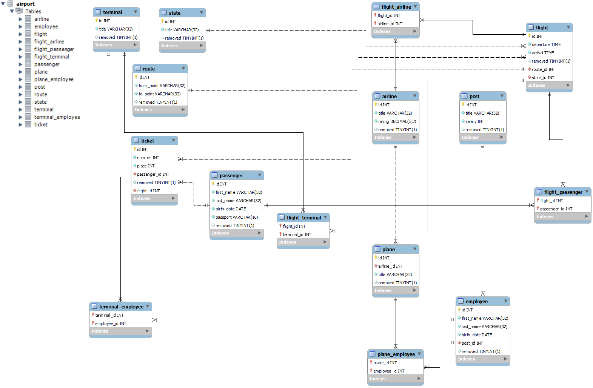

# Airport
### Структура пакетов, классов и файлов:
- **[main](src/main)**:
  - **[java](src/main/java)**:
    - **[database](src/main/java/com/itvdn/airport/petrov/configuration/database)** - *пакет, в котором происходит подключение к [БД](src/main/resources/init.sql)*
    - **[dao](src/main/java/com/itvdn/airport/petrov/dao)** - *пакет со всеми DAO (Data Access Object)*
      - **[impl](src/main/java/com/itvdn/airport/petrov/dao/impl)** - *пакет со всеми реализациями DAO (Data Access Object) из пакета [dao](src/main/java/com/itvdn/airport/petrov/dao)*
    - **[entity](src/main/java/com/itvdn/airport/petrov/entity)** - *пакет со всеми entities*
  - **[resources](src/main/resources)**:
    - **[airport.png](src/main/resources/airport.png)** - блоксхема [БД](src/main/resources/init.sql)
    - **[init.sql](src/main/resources/init.sql)** - init-файл БД
- **[test](src/test)**:
  - **[java](src/test/java)**:
    - **[dao](src/test/java/com/itvdn/airport/petrov/dao)** - *тестирование всех DAO (Data Access Object) из пакета [main.java.dao](src/main/java/com/itvdn/airport/petrov/dao)*
    - **[entity](src/test/java/com/itvdn/airport/petrov/entity)** - *тестирование всех entities  из пакета [main.java.entity](src/main/java/com/itvdn/airport/petrov/entity)*

### [Init SQL](src/main/resources/init.sql)
### Блоксхема [БД](src/main/resources/init.sql):

### dependencies:
```
<dependencies>
    <dependency>
        <groupId>org.hibernate</groupId>
        <artifactId>hibernate-core</artifactId>
        <version>5.6.5.Final</version>
    </dependency>
    <dependency>
        <groupId>org.projectlombok</groupId>
        <artifactId>lombok</artifactId>
        <version>1.18.22</version>
        <scope>provided</scope>
    </dependency>
    <dependency>
        <groupId>mysql</groupId>
        <artifactId>mysql-connector-java</artifactId>
        <version>8.0.28</version>
    </dependency>
    <dependency>
        <groupId>org.junit.jupiter</groupId>
        <artifactId>junit-jupiter-engine</artifactId>
        <version>5.4.0</version>
        <scope>test</scope>
    </dependency>
</dependencies>
```
### hibernate.cfg.xml:
```
<?xml version = "1.0" encoding = "utf-8"?>
<!DOCTYPE hibernate-configuration SYSTEM
        "http://www.hibernate.org/dtd/hibernate-configuration-3.0.dtd">
<hibernate-configuration>
    <session-factory>
        <property name="hibernate.dialect">org.hibernate.dialect.MySQL5Dialect</property>
        <property name="hibernate.connection.driver_class">com.mysql.jdbc.Driver</property>
        <property name="hibernate.connection.url">jdbc:mysql://host:port/airport?serverTimezone=UTC</property>
        <property name="hibernate.connection.username">****</property>
        <property name="hibernate.connection.password">****</property>
        <property name="connection.pool_size">20</property>
        <property name="hbm2ddl.auto">none</property>
        <property name="show_sql">false</property>

        <mapping class="com.itvdn.airport.petrov.entity.Airline" />
        <mapping class="com.itvdn.airport.petrov.entity.Employee" />
        <mapping class="com.itvdn.airport.petrov.entity.Flight" />
        <mapping class="com.itvdn.airport.petrov.entity.Plane" />
        <mapping class="com.itvdn.airport.petrov.entity.Passenger" />
        <mapping class="com.itvdn.airport.petrov.entity.Post" />
        <mapping class="com.itvdn.airport.petrov.entity.Route" />
        <mapping class="com.itvdn.airport.petrov.entity.State" />
        <mapping class="com.itvdn.airport.petrov.entity.Terminal" />
        <mapping class="com.itvdn.airport.petrov.entity.Ticket" />
    </session-factory>
</hibernate-configuration>
```
